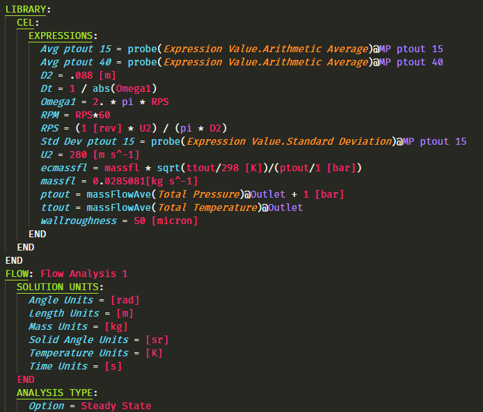

# ANSYS CFX Command Language (CCL):
### Language support for ANSYS CFX state languages, CCL and CEL.

## Features

- Syntax highlighting
    - Includes specific highlighting for CCL and CEL native functions and constants
- Code folding
- Supported file extensions: `.ccl` and `.cst`

## Please report bugs or feature requests on [GitHub](https://www.github.com/u2berggeist/ANSYS_CFX).

## Want to Contribute? Go [here](https://github.com/u2berggeist/ANSYS_CFX/blob/master/CONTRIBUTE%20INFO.md) to find some helpful resources!

